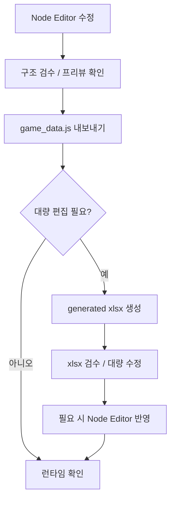

# 경성뎐 데이터 수정 / 검수 프로세스

## 1. 문서 목적

본 문서는 `경성뎐`의 데이터 수정과 검수를 어떤 순서로 진행할지 정리한 운영 문서다.

---

## 2. 기본 전제

- 메인 편집 툴은 `EditorNode`
- 런타임 반영 데이터는 `game_data.js`
- 대량 편집 / 검수 / 공유 시에만 `xlsx` 사용

---

## 3. 기본 프로세스

---

## 4. 수정 단계

### 4-1. 구조 수정

다음 작업은 Node Editor 우선으로 진행한다.

- 씬 추가 / 삭제 / 복제
- 씬 연결 수정
- 선택지 연결 수정
- 분기 연결 수정
- 단서 연결 수정

### 4-2. 텍스트 수정

소규모 수정:

- Node Editor에서 직접 수정

대량 수정:

- generated xlsx 생성 후 표 기준 수정

---

## 5. 검수 단계

Node Editor에서 먼저 확인:

- 끊긴 연결
- 미참조 씬
- 중복 ID
- 엔딩 구조
- 읽는 상태 참조 / 쓰는 상태 결과

xlsx에서 추가 확인:

- 대사량 검수
- 표 단위 누락 확인
- 정렬 / 공유용 확인

---

## 6. 반영 단계

1. Node Editor 수정 완료
2. `game_data.js` 내보내기
3. 필요 시 generated xlsx 생성
4. 검수 후 최종 런타임 확인

---

## 7. 하지 않는 것

- `script.xlsx` 자동 덮어쓰기
- `game_data.js` 직접 수기 수정
- 구조 수정의 xlsx 우선 처리

---

## 8. 한 줄 정리

`경성뎐`의 데이터 수정 프로세스는 `Node Editor 중심 편집 -> game_data 반영 -> 필요 시 xlsx 검수` 순서로 운영한다.
