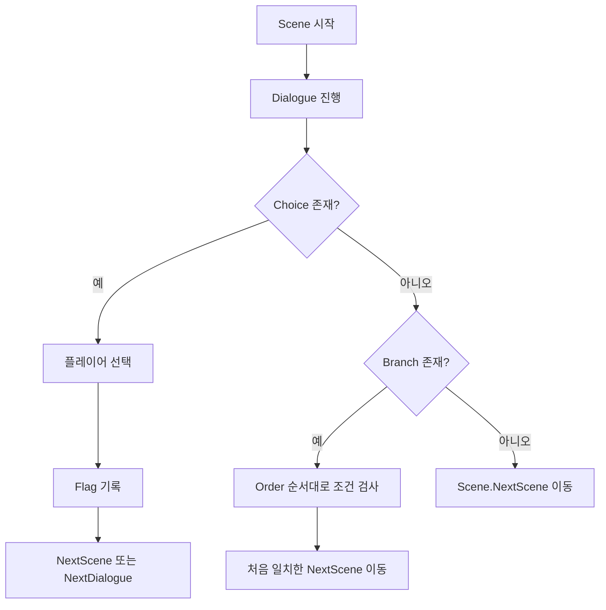

# 경성뎐 분기 설계서

## 1. 문서 목적

본 문서는 `경성뎐`의 분기 구조를 어떻게 설계하고 검수할 것인지 정리한 문서다.

여기서 말하는 분기는 크게 두 종류다.

- 선택지 분기
- 상태값 기반 후속 분기

---

## 2. 분기 단위

### 2-1. Choice 분기

플레이어가 직접 선택하는 분기다.

역할:

- 선택 결과 기록
- 즉시 다음 씬 이동
- 같은 씬 내 특정 라벨로 점프

주요 컬럼:

- `Text`
- `FlagKey`
- `StateValue`
- `NextScene`
- `NextDialogue`

### 2-2. Branch 분기

이전에 누적된 상태값을 읽고, 씬 종료 후 다음 씬을 결정하는 분기다.

역할:

- 이미 기록된 선택 결과 반영
- 특정 엔딩 또는 루트 분기
- 숨은 조건 처리

주요 컬럼:

- `Order`
- `FlagKey`
- `StateValue`
- `NextScene`

---

## 3. 기본 분기 흐름

---

## 4. 설계 원칙

### 4-1. 선택과 결과를 분리한다

- `Choice`는 선택 순간의 결과를 기록한다.
- `Branch`는 이후 흐름에서 그 결과를 읽는다.

즉, 선택과 결과 적용을 한 테이블에 모두 몰아넣지 않고 역할을 나누는 방식이다.

### 4-2. 분기 우선순위를 명확히 둔다

- 같은 씬에 여러 분기가 있으면 `Order`로 우선순위를 고정한다.
- 조건이 겹치면 먼저 평가되는 쪽이 항상 우선된다.

### 4-3. 라벨 점프와 씬 이동은 목적을 분리한다

- `NextDialogue`는 같은 씬 내부 흐름 제어
- `NextScene`은 씬 전환 제어

둘은 같은 역할이 아니므로 기획 단계에서 의도를 분명히 해야 한다.

---

## 5. 검수 포인트

- 존재하지 않는 `NextScene`이 없는가
- 존재하지 않는 `NextDialogue` 라벨을 참조하지 않는가
- 같은 조건을 여러 `Branch`가 중복으로 읽고 있지 않은가
- 엔딩 분기 조건이 누락되지 않았는가
- 선택 후 기록한 플래그를 실제로 후속 분기에서 읽는가

---

## 6. Node Editor 기준 검토 항목

현재 `EditorNode`에서 확인 가능한 분기 관련 정보는 다음과 같다.

- 씬 간 연결선 확인
- 선택지 연결 확인
- 분기 연결 확인
- 현재 씬이 읽는 상태 참조 / 쓰는 상태 결과 확인
- 이전 연결 / 다음 연결 확인
- 미참조 씬 확인

---

## 7. 향후 확장 방향

- 특정 플래그 기준 루트 추적
- 엔딩 전용 분기 묶음 시각화
- 조건 대사와 선택 분기를 함께 보여주는 흐름 프리뷰

---

## 8. 한 줄 정리

`경성뎐`의 분기 설계는 `선택 기록(Choice)`과 `후속 적용(Branch)`을 분리해, 서사 구조를 더 안정적으로 관리하는 방향을 기본으로 한다.
